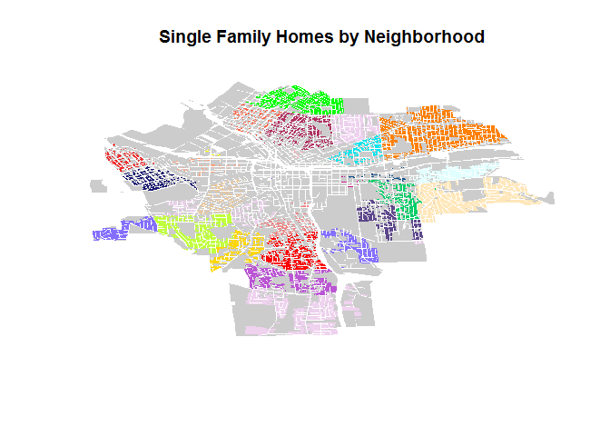
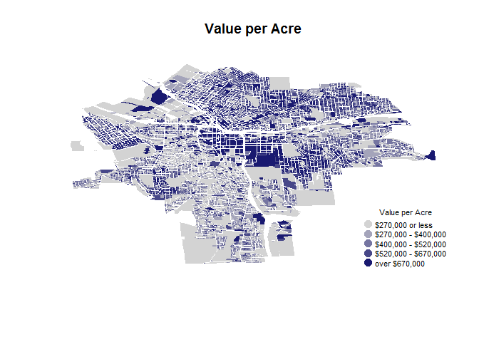
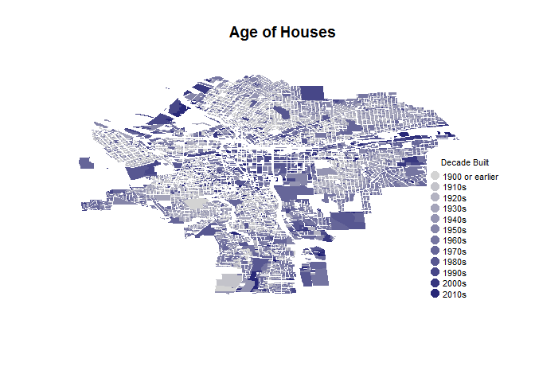

Lab 04
================

### Question 1: Single Family Homes

``` r
#Table
syr.dat <- as.data.frame(syr)
single.family.2 <- filter( syr.dat, LandUse == "Single Family" )
table(single.family.2$Nhood) %>% pander
```

<table style="width:100%;">
<caption>Table continues below</caption>
<colgroup>
<col width="14%" />
<col width="22%" />
<col width="14%" />
<col width="14%" />
<col width="13%" />
<col width="18%" />
</colgroup>
<thead>
<tr class="header">
<th align="center">Brighton</th>
<th align="center">Court-Woodlawn</th>
<th align="center">Downtown</th>
<th align="center">Eastwood</th>
<th align="center">Elmwood</th>
<th align="center">Far Westside</th>
</tr>
</thead>
<tbody>
<tr class="odd">
<td align="center">1398</td>
<td align="center">1859</td>
<td align="center">1</td>
<td align="center">3605</td>
<td align="center">909</td>
<td align="center">471</td>
</tr>
</tbody>
</table>

<table>
<caption>Table continues below</caption>
<colgroup>
<col width="24%" />
<col width="20%" />
<col width="16%" />
<col width="20%" />
<col width="20%" />
</colgroup>
<thead>
<tr class="header">
<th align="center">Franklin Square</th>
<th align="center">Hawley-Green</th>
<th align="center">Lakefront</th>
<th align="center">Lincoln Hill</th>
<th align="center">Meadowbrook</th>
</tr>
</thead>
<tbody>
<tr class="odd">
<td align="center">0</td>
<td align="center">52</td>
<td align="center">24</td>
<td align="center">580</td>
<td align="center">1721</td>
</tr>
</tbody>
</table>

<table>
<caption>Table continues below</caption>
<colgroup>
<col width="21%" />
<col width="21%" />
<col width="20%" />
<col width="16%" />
<col width="21%" />
</colgroup>
<thead>
<tr class="header">
<th align="center">Near Eastside</th>
<th align="center">Near Westside</th>
<th align="center">North Valley</th>
<th align="center">Northside</th>
<th align="center">Outer Comstock</th>
</tr>
</thead>
<tbody>
<tr class="odd">
<td align="center">93</td>
<td align="center">521</td>
<td align="center">1194</td>
<td align="center">1508</td>
<td align="center">697</td>
</tr>
</tbody>
</table>

<table style="width:92%;">
<caption>Table continues below</caption>
<colgroup>
<col width="16%" />
<col width="22%" />
<col width="20%" />
<col width="15%" />
<col width="16%" />
</colgroup>
<thead>
<tr class="header">
<th align="center">Park Ave.</th>
<th align="center">Prospect Hill</th>
<th align="center">Salt Springs</th>
<th align="center">Sedgwick</th>
<th align="center">Skunk City</th>
</tr>
</thead>
<tbody>
<tr class="odd">
<td align="center">167</td>
<td align="center">29</td>
<td align="center">1029</td>
<td align="center">892</td>
<td align="center">345</td>
</tr>
</tbody>
</table>

<table>
<caption>Table continues below</caption>
<colgroup>
<col width="18%" />
<col width="18%" />
<col width="15%" />
<col width="15%" />
<col width="16%" />
<col width="16%" />
</colgroup>
<thead>
<tr class="header">
<th align="center">South Campus</th>
<th align="center">South Valley</th>
<th align="center">Southside</th>
<th align="center">Southwest</th>
<th align="center">Strathmore</th>
<th align="center">Tipp Hill</th>
</tr>
</thead>
<tbody>
<tr class="odd">
<td align="center">25</td>
<td align="center">1605</td>
<td align="center">481</td>
<td align="center">419</td>
<td align="center">1475</td>
<td align="center">785</td>
</tr>
</tbody>
</table>

<table>
<caption>Table continues below</caption>
<colgroup>
<col width="24%" />
<col width="35%" />
<col width="27%" />
<col width="13%" />
</colgroup>
<thead>
<tr class="header">
<th align="center">University Hill</th>
<th align="center">University Neighborhood</th>
<th align="center">Washington Square</th>
<th align="center">Westcott</th>
</tr>
</thead>
<tbody>
<tr class="odd">
<td align="center">17</td>
<td align="center">803</td>
<td align="center">425</td>
<td align="center">851</td>
</tr>
</tbody>
</table>

<table style="width:15%;">
<colgroup>
<col width="15%" />
</colgroup>
<thead>
<tr class="header">
<th align="center">Winkworth</th>
</tr>
</thead>
<tbody>
<tr class="odd">
<td align="center">411</td>
</tr>
</tbody>
</table>

``` r
#Map
br <- syr$Nhood == "Brighton"
cw <- syr$Nhood == "Court-Woodlawn"
d <- syr$Nhood == "Downtown"
e <- syr$Nhood == "Eastwood"
elm <- syr$Nhood == "Elmwood"
fw <- syr$Nhood == "Far Westside"
fs <- syr$Nhood == "Franklin Square"
hg <- syr$Nhood == "Hawley-Green"
l <- syr$Nhood == "Lakefront"
lh <- syr$Nhood == "Lincoln Hill"
m <- syr$Nhood == "Meadowbrook"
ne <- syr$Nhood == "Near Eastside"
nw <- syr$Nhood == "Near Westside"
nv <- syr$Nhood == "North Valley"
n <- syr$Nhood == "Northside"
oc <- syr$Nhood == "Outer Comstock"
pa <- syr$Nhood == "Park Ave."
ph <- syr$Nhood == "Prospect Hill"
ss <- syr$Nhood == "Salt Springs"
s <- syr$Nhood == "Sedgwick"
sc <- syr$Nhood == "Skunk City"
scp <- syr$Nhood == "South Campus"
sv <- syr$Nhood == "South Valley"
s <- syr$Nhood == "Southside"
sw <- syr$Nhood == "Southwest"
str <- syr$Nhood == "Strathmore"
th <- syr$Nhood == "Tipp Hill"
uh <- syr$Nhood == "University Hill"
un <-syr$Nhood == "University Neighborhood"
ws <- syr$Nhood == "Washington Square"
w <- syr$Nhood == "Westcott"
ww <- syr$Nhood == "Winkworth"

all.single.family <- ifelse(syr$LandUse == "Single Family" , "thistle2", NA)

single.family <- ifelse(syr$LandUse == "Single Family" , 
                        ifelse(br, "red", ifelse(cw,"green", ifelse(d , "blueviolet" , ifelse( e , "darkorange1" , ifelse( elm , "gold1", ifelse( fw , "firebrick2" , ifelse( fs , "green1", ifelse( hg , "honeydew2" , ifelse( l , "yellow1", ifelse( lh , "turquoise2", ifelse( m , "wheat1", ifelse( ne , "dodgerblue4", ifelse(nw , "burlywood2", ifelse(nv , "mediumorchid", ifelse( n , "maroon" , ifelse( oc , "lightslateblue", ifelse( pa , "lightsalmon1" , ifelse( ph , "lightpink1" , ifelse( ss , "lightcyan", ifelse( s , "lightcoral" , ifelse( str , "olivedrab1" , ifelse(th , "midnightblue" , ifelse( uh , "mediumvioletred" , ifelse( un , "mediumpurple4" , ifelse( ws , "tomato" , ifelse( w , "springgreen3" , ifelse( ww , "slateblue1" , NA))))))))))))))))))))))))))), NA)

plot(syr, border = FALSE, col="gray80")
plot(syr, border = FALSE , col = all.single.family, add=TRUE)
plot( syr, border = FALSE, col=single.family , add=TRUE ) 

title( main="Single Family Homes by Neighborhood")
```



``` r
#empty vector light gray and repeat from 1 to the number of parcels use 
#pallate function -- ask for colors by factor will use colors in pallet, if you do a plot -- make nhood a factor and then use color function to make pallet have 40 colors -- copy nhood factor, if not sinlge family then assign NA
```

### Question 2: Percent of Single Family Homes by Neighborhood and Value per Acre

``` r
#Table
syr.single.price <- syr[syr$LandUse == "Single Family" & syr$AssessedVa > "200000" , ]
round(prop.table(table(syr.single.price$Nhood))*100, 2) %>% pander
```

<table style="width:100%;">
<caption>Table continues below</caption>
<colgroup>
<col width="14%" />
<col width="22%" />
<col width="14%" />
<col width="14%" />
<col width="13%" />
<col width="18%" />
</colgroup>
<thead>
<tr class="header">
<th align="center">Brighton</th>
<th align="center">Court-Woodlawn</th>
<th align="center">Downtown</th>
<th align="center">Eastwood</th>
<th align="center">Elmwood</th>
<th align="center">Far Westside</th>
</tr>
</thead>
<tbody>
<tr class="odd">
<td align="center">6.37</td>
<td align="center">8.74</td>
<td align="center">0</td>
<td align="center">16.48</td>
<td align="center">4.24</td>
<td align="center">2.21</td>
</tr>
</tbody>
</table>

<table>
<caption>Table continues below</caption>
<colgroup>
<col width="24%" />
<col width="20%" />
<col width="16%" />
<col width="20%" />
<col width="20%" />
</colgroup>
<thead>
<tr class="header">
<th align="center">Franklin Square</th>
<th align="center">Hawley-Green</th>
<th align="center">Lakefront</th>
<th align="center">Lincoln Hill</th>
<th align="center">Meadowbrook</th>
</tr>
</thead>
<tbody>
<tr class="odd">
<td align="center">0</td>
<td align="center">0.24</td>
<td align="center">0.11</td>
<td align="center">2.56</td>
<td align="center">3.22</td>
</tr>
</tbody>
</table>

<table>
<caption>Table continues below</caption>
<colgroup>
<col width="21%" />
<col width="21%" />
<col width="20%" />
<col width="16%" />
<col width="21%" />
</colgroup>
<thead>
<tr class="header">
<th align="center">Near Eastside</th>
<th align="center">Near Westside</th>
<th align="center">North Valley</th>
<th align="center">Northside</th>
<th align="center">Outer Comstock</th>
</tr>
</thead>
<tbody>
<tr class="odd">
<td align="center">0.41</td>
<td align="center">2.24</td>
<td align="center">5.67</td>
<td align="center">7.11</td>
<td align="center">3.03</td>
</tr>
</tbody>
</table>

<table style="width:92%;">
<caption>Table continues below</caption>
<colgroup>
<col width="16%" />
<col width="22%" />
<col width="20%" />
<col width="15%" />
<col width="16%" />
</colgroup>
<thead>
<tr class="header">
<th align="center">Park Ave.</th>
<th align="center">Prospect Hill</th>
<th align="center">Salt Springs</th>
<th align="center">Sedgwick</th>
<th align="center">Skunk City</th>
</tr>
</thead>
<tbody>
<tr class="odd">
<td align="center">0.78</td>
<td align="center">0.13</td>
<td align="center">4.87</td>
<td align="center">2.59</td>
<td align="center">1.63</td>
</tr>
</tbody>
</table>

<table>
<caption>Table continues below</caption>
<colgroup>
<col width="18%" />
<col width="18%" />
<col width="15%" />
<col width="15%" />
<col width="16%" />
<col width="16%" />
</colgroup>
<thead>
<tr class="header">
<th align="center">South Campus</th>
<th align="center">South Valley</th>
<th align="center">Southside</th>
<th align="center">Southwest</th>
<th align="center">Strathmore</th>
<th align="center">Tipp Hill</th>
</tr>
</thead>
<tbody>
<tr class="odd">
<td align="center">0.03</td>
<td align="center">7.39</td>
<td align="center">2.16</td>
<td align="center">1.85</td>
<td align="center">4.77</td>
<td align="center">3.66</td>
</tr>
</tbody>
</table>

<table>
<caption>Table continues below</caption>
<colgroup>
<col width="24%" />
<col width="35%" />
<col width="27%" />
<col width="13%" />
</colgroup>
<thead>
<tr class="header">
<th align="center">University Hill</th>
<th align="center">University Neighborhood</th>
<th align="center">Washington Square</th>
<th align="center">Westcott</th>
</tr>
</thead>
<tbody>
<tr class="odd">
<td align="center">0.08</td>
<td align="center">1.46</td>
<td align="center">1.99</td>
<td align="center">3.01</td>
</tr>
</tbody>
</table>

<table style="width:15%;">
<colgroup>
<col width="15%" />
</colgroup>
<thead>
<tr class="header">
<th align="center">Winkworth</th>
</tr>
</thead>
<tbody>
<tr class="odd">
<td align="center">0.96</td>
</tr>
</tbody>
</table>

``` r
#Map
syr.dat.2 <- mutate( syr.dat, value.per.acre = syr.dat$AssessedVa/syr.dat$Acres )
syr.2 <- merge( syr , syr.dat.2 ) 

color.function <- colorRampPalette( c("light gray", "midnightblue" ) )
col.ramp <- color.function( 5 )

color.vector <- cut( syr.2$value.per.acre , breaks = c(0, 270000, 400000, 520000, 670000 , 100000000 ) , labels = col.ramp)
color.vector <- as.character( color.vector )

plot(syr.2, border=FALSE, col=color.vector)


title( main="Value per Acre")

legend.text=c("$270,000 or less", "$270,000 - $400,000", "$400,000 - $520,000", "$520,000 - $670,000", "over $670,000")

legend( "bottomright", bg="white",
        pch=19, pt.cex=1.5, cex=0.7,
        legend=legend.text, 
        col=col.ramp, 
        box.col="white",
        title="Value per Acre" 
)
```



### Question 3: Age of Homes

``` r
#Table
syr.ages <- mutate( syr.dat , age = 2017 - as.numeric(as.character(YearBuilt)))
syr.ages <- syr.ages[ syr.ages$age < 2017 , ]

syr.grouped <- group_by(syr.ages , Nhood)
tab <- summarise(syr.grouped , "10th" = quantile(na.omit(age), .1) , "25th" = quantile(na.omit(age), .25) , "50th" = quantile(na.omit(age), .5) ,  "75th" = quantile(na.omit(age), .75) , "90th" = quantile(na.omit(age), .9) )
tab %>% pander
```

<table style="width:82%;">
<colgroup>
<col width="33%" />
<col width="9%" />
<col width="9%" />
<col width="9%" />
<col width="9%" />
<col width="9%" />
</colgroup>
<thead>
<tr class="header">
<th align="center">Nhood</th>
<th align="center">10th</th>
<th align="center">25th</th>
<th align="center">50th</th>
<th align="center">75th</th>
<th align="center">90th</th>
</tr>
</thead>
<tbody>
<tr class="odd">
<td align="center">Brighton</td>
<td align="center">62.0</td>
<td align="center">87.00</td>
<td align="center">97.0</td>
<td align="center">107.00</td>
<td align="center">117.0</td>
</tr>
<tr class="even">
<td align="center">Court-Woodlawn</td>
<td align="center">64.0</td>
<td align="center">77.00</td>
<td align="center">89.0</td>
<td align="center">97.00</td>
<td align="center">117.0</td>
</tr>
<tr class="odd">
<td align="center">Downtown</td>
<td align="center">34.0</td>
<td align="center">47.00</td>
<td align="center">67.0</td>
<td align="center">96.00</td>
<td align="center">117.0</td>
</tr>
<tr class="even">
<td align="center">Eastwood</td>
<td align="center">61.0</td>
<td align="center">74.00</td>
<td align="center">88.0</td>
<td align="center">97.00</td>
<td align="center">102.0</td>
</tr>
<tr class="odd">
<td align="center">Elmwood</td>
<td align="center">62.0</td>
<td align="center">82.00</td>
<td align="center">90.0</td>
<td align="center">99.50</td>
<td align="center">117.0</td>
</tr>
<tr class="even">
<td align="center">Far Westside</td>
<td align="center">67.0</td>
<td align="center">92.00</td>
<td align="center">102.0</td>
<td align="center">117.00</td>
<td align="center">127.0</td>
</tr>
<tr class="odd">
<td align="center">Franklin Square</td>
<td align="center">27.0</td>
<td align="center">36.00</td>
<td align="center">58.0</td>
<td align="center">77.00</td>
<td align="center">97.0</td>
</tr>
<tr class="even">
<td align="center">Hawley-Green</td>
<td align="center">55.4</td>
<td align="center">72.00</td>
<td align="center">102.0</td>
<td align="center">117.00</td>
<td align="center">137.0</td>
</tr>
<tr class="odd">
<td align="center">Lakefront</td>
<td align="center">31.0</td>
<td align="center">52.00</td>
<td align="center">67.0</td>
<td align="center">97.00</td>
<td align="center">117.0</td>
</tr>
<tr class="even">
<td align="center">Lincoln Hill</td>
<td align="center">49.6</td>
<td align="center">87.00</td>
<td align="center">97.0</td>
<td align="center">117.00</td>
<td align="center">137.0</td>
</tr>
<tr class="odd">
<td align="center">Meadowbrook</td>
<td align="center">57.0</td>
<td align="center">62.00</td>
<td align="center">67.0</td>
<td align="center">85.00</td>
<td align="center">92.0</td>
</tr>
<tr class="even">
<td align="center">Near Eastside</td>
<td align="center">30.0</td>
<td align="center">62.25</td>
<td align="center">87.0</td>
<td align="center">105.75</td>
<td align="center">117.0</td>
</tr>
<tr class="odd">
<td align="center">Near Westside</td>
<td align="center">26.0</td>
<td align="center">77.00</td>
<td align="center">97.0</td>
<td align="center">117.00</td>
<td align="center">127.0</td>
</tr>
<tr class="even">
<td align="center">North Valley</td>
<td align="center">57.0</td>
<td align="center">62.00</td>
<td align="center">82.0</td>
<td align="center">93.00</td>
<td align="center">107.0</td>
</tr>
<tr class="odd">
<td align="center">Northside</td>
<td align="center">79.0</td>
<td align="center">93.25</td>
<td align="center">107.0</td>
<td align="center">117.00</td>
<td align="center">127.0</td>
</tr>
<tr class="even">
<td align="center">Outer Comstock</td>
<td align="center">42.0</td>
<td align="center">55.00</td>
<td align="center">65.5</td>
<td align="center">72.00</td>
<td align="center">92.0</td>
</tr>
<tr class="odd">
<td align="center">Park Ave.</td>
<td align="center">64.0</td>
<td align="center">87.00</td>
<td align="center">101.0</td>
<td align="center">117.00</td>
<td align="center">122.0</td>
</tr>
<tr class="even">
<td align="center">Prospect Hill</td>
<td align="center">37.0</td>
<td align="center">67.00</td>
<td align="center">97.0</td>
<td align="center">117.00</td>
<td align="center">127.0</td>
</tr>
<tr class="odd">
<td align="center">Salt Springs</td>
<td align="center">49.0</td>
<td align="center">60.00</td>
<td align="center">72.0</td>
<td align="center">89.00</td>
<td align="center">97.0</td>
</tr>
<tr class="even">
<td align="center">Sedgwick</td>
<td align="center">64.0</td>
<td align="center">77.00</td>
<td align="center">87.0</td>
<td align="center">97.00</td>
<td align="center">112.0</td>
</tr>
<tr class="odd">
<td align="center">Skunk City</td>
<td align="center">57.0</td>
<td align="center">87.00</td>
<td align="center">97.0</td>
<td align="center">117.00</td>
<td align="center">127.0</td>
</tr>
<tr class="even">
<td align="center">South Campus</td>
<td align="center">27.3</td>
<td align="center">42.00</td>
<td align="center">56.5</td>
<td align="center">71.00</td>
<td align="center">87.8</td>
</tr>
<tr class="odd">
<td align="center">South Valley</td>
<td align="center">52.0</td>
<td align="center">59.00</td>
<td align="center">67.0</td>
<td align="center">87.00</td>
<td align="center">97.0</td>
</tr>
<tr class="even">
<td align="center">Southside</td>
<td align="center">32.0</td>
<td align="center">87.00</td>
<td align="center">97.0</td>
<td align="center">117.00</td>
<td align="center">117.0</td>
</tr>
<tr class="odd">
<td align="center">Southwest</td>
<td align="center">23.0</td>
<td align="center">42.00</td>
<td align="center">95.0</td>
<td align="center">107.00</td>
<td align="center">117.0</td>
</tr>
<tr class="even">
<td align="center">Strathmore</td>
<td align="center">62.0</td>
<td align="center">82.00</td>
<td align="center">92.0</td>
<td align="center">99.00</td>
<td align="center">117.0</td>
</tr>
<tr class="odd">
<td align="center">Tipp Hill</td>
<td align="center">72.0</td>
<td align="center">92.00</td>
<td align="center">107.0</td>
<td align="center">117.00</td>
<td align="center">127.0</td>
</tr>
<tr class="even">
<td align="center">University Hill</td>
<td align="center">33.0</td>
<td align="center">44.00</td>
<td align="center">57.0</td>
<td align="center">77.00</td>
<td align="center">97.0</td>
</tr>
<tr class="odd">
<td align="center">University Neighborhood</td>
<td align="center">64.0</td>
<td align="center">74.00</td>
<td align="center">91.0</td>
<td align="center">97.00</td>
<td align="center">107.0</td>
</tr>
<tr class="even">
<td align="center">Washington Square</td>
<td align="center">70.0</td>
<td align="center">87.00</td>
<td align="center">107.0</td>
<td align="center">127.00</td>
<td align="center">147.0</td>
</tr>
<tr class="odd">
<td align="center">Westcott</td>
<td align="center">62.0</td>
<td align="center">87.00</td>
<td align="center">97.0</td>
<td align="center">107.00</td>
<td align="center">117.0</td>
</tr>
<tr class="even">
<td align="center">Winkworth</td>
<td align="center">44.7</td>
<td align="center">57.00</td>
<td align="center">62.0</td>
<td align="center">69.25</td>
<td align="center">87.3</td>
</tr>
<tr class="odd">
<td align="center">NA</td>
<td align="center">27.7</td>
<td align="center">31.75</td>
<td align="center">38.5</td>
<td align="center">45.25</td>
<td align="center">49.3</td>
</tr>
</tbody>
</table>

``` r
#Map
dec <- cut( as.numeric(as.character(syr$YearBuilt)) , breaks = c( 0, 1900 , seq(1910, 2020, 10)))

color.function <- colorRampPalette( c("light gray", "midnightblue" ) )
col.ramp <- color.function( 13 )

color.vector <- cut( as.numeric(as.character(syr$YearBuilt)) , breaks = c( 0, 1900 , seq(1910, 2020, 10)), labels = col.ramp )
color.vector <- as.character( color.vector )

plot(syr, border=FALSE, col=color.vector)


title( main="Age of Houses")

#map.scale( metric=F, ratio=F, relwidth = 0.15, cex=0.5 )

legend.text=c("1900 or earlier", "1910s", "1920s", "1930s", "1940s", "1950s", "1960s", "1970s", "1980s", "1990s", "2000s", "2010s")

legend( "bottomright", bg="white",
        pch=19, pt.cex=1.5, cex=0.7,
        legend=legend.text, 
        col=col.ramp, 
        box.col="white",
        title="Decade Built" 
)
```


