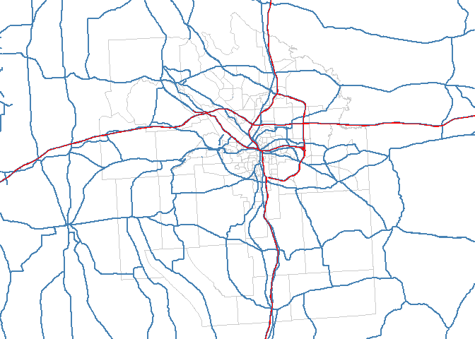
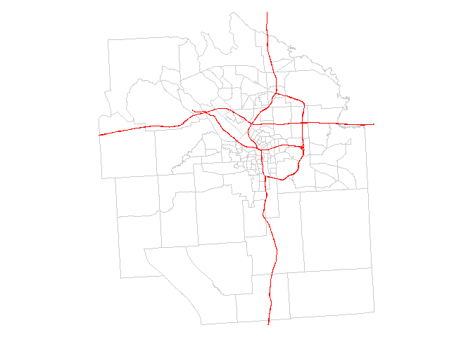
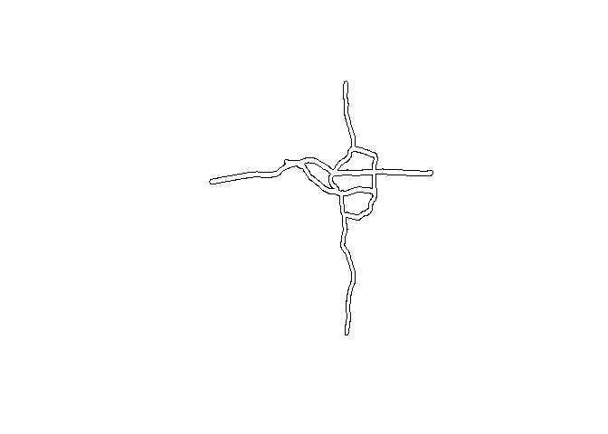
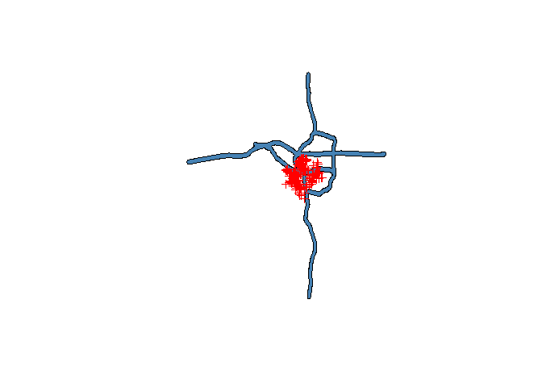
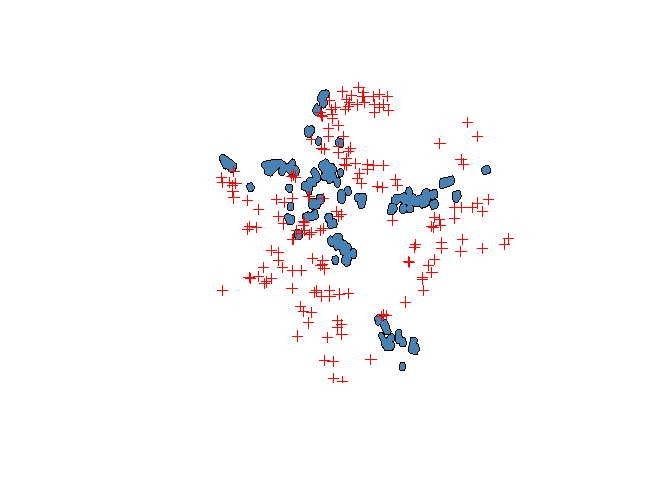
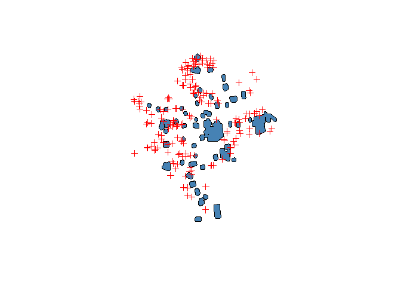

Lab06
================

``` r
#Road Data

download.file("ftp://ftp2.census.gov/geo/tiger/TIGER2015/PRISECROADS/tl_2015_36_prisecroads.zip", "primary_and_secondary_roads.zip" )
unzip( "primary_and_secondary_roads.zip" )
file.remove( "primary_and_secondary_roads.zip" )
```

    ## [1] TRUE

``` r
roads <- readShapeLines( fn="tl_2015_36_prisecroads", proj4string=CRS("+proj=longlat +datum=WGS84") )

#source('C:/Users/STEPHA~1/AppData/Local/Temp/Download Road Shapefiles.R')

interstate <- roads[ roads$RTTYP == "I" , ]

#Plot
par( mar=c(0,0,0,0) )
plot( onondaga,  border="gray80" )
plot( roads, col="steelblue", lwd=2, add=T )
plot( interstate, col="red", add=T )
```



``` r
#Clip roads to size of county

gClip <- function(shp, bb){
  if(class(bb) == "matrix") b_poly <- as(extent(as.vector(t(bb))), "SpatialPolygons")
  else b_poly <- as(extent(bb), "SpatialPolygons")
  gIntersection(shp, b_poly, byid = T)
}

roads_clipped <- gClip( interstate , onondaga)

par( mar=c(0,0,0,0) )
plot( onondaga,  border="gray80" )
plot( roads_clipped, col="red", add = T )
```



``` r
#Create buffer quarter mile from intersate, disolve

buff1 <- gBuffer( roads_clipped, width=.005, byid=FALSE )
plot(buff1)
```



``` r
buff2 <- gUnaryUnion( buff1, id = NULL )


plot(buff2, col="steelblue")
#plot(onondaga, add = TRUE)
plot(zill.spatial, col="red", add = TRUE)
```



``` r
in.buff <- over(zill.spatial , buff2)

zill.in.buff <- cbind( zill.dat.2 , in.buff)
```

### Part II

``` r
#download geoJSON 

u <- "https://raw.githubusercontent.com/lecy/geojson/master/syr_parcels.geojson"
setwd("/Users/Stephanie/Google Drive/ssw/MPA/DDM 2")
downloader::download(url = u, destfile = "/Users/Stephanie/Google Drive/ssw/MPA/DDM 2/syr_parcels.GeoJSON")
syr.g <- readOGR(dsn="/Users/Stephanie/Google Drive/ssw/MPA/DDM 2/syr_parcels.GeoJSON", layer="OGRGeoJSON")
```

    ## OGR data source with driver: GeoJSON 
    ## Source: "/Users/Stephanie/Google Drive/ssw/MPA/DDM 2/syr_parcels.GeoJSON", layer: "OGRGeoJSON"
    ## with 41502 features
    ## It has 64 fields

``` r
#Buffer around Industrial Zones
syr.I <- syr.g[syr.g$LandUse == "Industrial", ]

buff.I <- gBuffer( syr.I, width = .001 , byid = TRUE)
buff.I2 <- gUnaryUnion( buff.I, id = NULL )
buff.I3 <- spTransform(buff.I2, CRS("+proj=longlat +datum=WGS84")) #need +datum=WGS84

plot(buff.I3, col="steelblue")
#plot(syr.g, add = TRUE)
plot(zill.spatial, col = "red", add = TRUE)
```



``` r
in.buff.I <- over(zill.spatial , buff.I3)

zill.in.buff.I <- cbind( zill.dat.2 , in.buff.I)


#Buffer around Schools
syr.S <- syr.g[syr.g$LandUse == "Schools" , ]

buff.S <- gBuffer( syr.S , width = .001 , byid = TRUE)
buff.S2 <- gUnaryUnion( buff.S , id = NULL )
buff.S3 <- spTransform(buff.S2, CRS("+proj=longlat +datum=WGS84"))

plot(buff.S3, col="steelblue")
#plot(syr.g, add = TRUE)
plot(zill.spatial, col= "red", add = TRUE)
```



``` r
in.buff.S <- over(zill.spatial , buff.S3)

zill.in.buff.S <- cbind( zill.dat.2 , in.buff.S)
```
